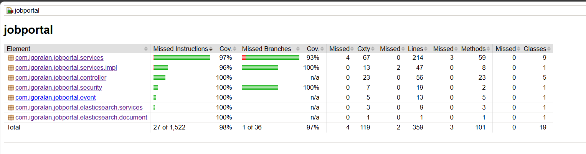
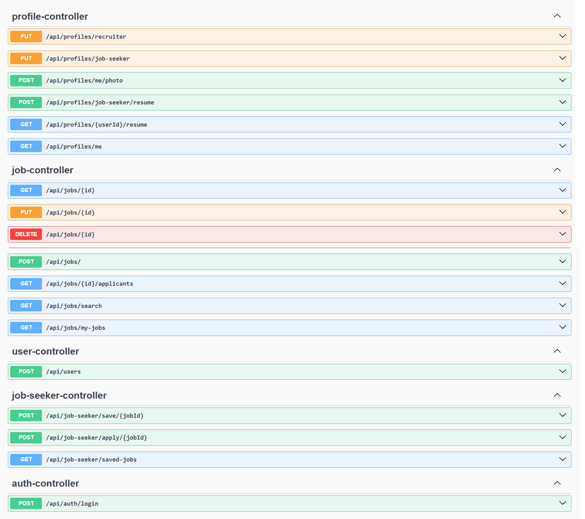

# Job Portal

Bem-vindo à API do Job Portal! Esta é uma plataforma robusta para publicação e candidatura de vagas de emprego, construída com uma arquitetura moderna, escalável e orientada a serviços.

O projeto utiliza as melhores práticas do ecossistema Java e Spring, com uma infraestrutura totalmente containerizada e orquestrada para um ambiente de desenvolvimento que espelha a produção.

## Tecnologias Utilizadas

A arquitetura do projeto foi desenhada para ser resiliente e performática, utilizando a ferramenta certa para cada trabalho (persistência poliglota).

### Backend
* **Java 21**
* **Spring Boot 3.3+**: Framework principal para a construção da API REST.
* **Spring Security**: Para autenticação e autorização, utilizando **JWT (JSON Web Tokens)**.
* **Spring Data JPA**: Para persistência de dados transacionais com o PostgreSQL.
* **Spring Data Elasticsearch**: Para buscas complexas e de alta performance.
* **Spring AMQP**: Para integração com o broker de mensageria RabbitMQ.
* **Spring Data Redis**: Para cache de dados e sessões.
* **Flyway**: Para versionamento e migração do schema do banco de dados.
* **MapStruct**: Para mapeamento eficiente entre Entidades e DTOs.
* **Lombok**: Para reduzir código boilerplate.
* **Maven**: Para gerenciamento de dependências e build do projeto.

### Infraestrutura e Dados
* **PostgreSQL**: Banco de dados relacional principal.
* **Elasticsearch**: Motor de busca para a pesquisa de vagas.
* **Redis**: Banco de dados em memória para cache.
* **RabbitMQ**: Broker de mensageria para processamento de tarefas assíncronas.

### Ambiente de Desenvolvimento e Orquestração
* **Docker**: Para containerizar todos os serviços da aplicação.
* **Kubernetes**: Orquestrador de containers que define nossa infraestrutura.
* **Tilt**: Ferramenta para orquestrar e gerenciar o ambiente de desenvolvimento Kubernetes localmente, com live-reload.

## Arquitetura

A API segue os princípios de **Clean Architecture** e **SOLID**, com uma clara separação de responsabilidades:

* **Controllers**: Camada fina responsável por gerenciar as requisições HTTP e retornar DTOs.
* **Services**: Onde reside toda a lógica de negócio.
* **Repositories**: Camada de acesso a dados, abstraindo a comunicação com as fontes de dados (JPA para PostgreSQL, ElasticsearchRepository para Elasticsearch).
* **DTOs (Data Transfer Objects)**: Usados em todas as camadas da API para garantir um contrato seguro e desacoplado da estrutura do banco de dados.

### Schema do Banco de Dados

A estrutura relacional principal, gerida pelo PostgreSQL, é a seguinte:


## Utilização

### Pré-requisitos

Para rodar a aplicação localmente, você precisa ter as seguintes ferramentas instaladas:
1.  **Docker Desktop**: [Link de Instalação](https://www.docker.com/products/docker-desktop/)
2.  **Kubernetes**: Habilitado dentro do Docker Desktop (`Settings -> Kubernetes -> Enable Kubernetes`).
3.  **Tilt**: [Link de Instalação](https://docs.tilt.dev/install.html)

### Rodando via Tilt (Método Recomendado)

O **Tilt** é a ferramenta principal para o desenvolvimento, orquestrando todo o ambiente Kubernetes localmente.

Para subir toda a aplicação (backend, banco de dados, e todos os outros serviços), basta executar um único comando na pasta raíz do projeto:

```bash
tilt up
```

## Rodando manualmente

Esta é uma alternativa para desenvolvedores que preferem não usar o Tilt e Kubernetes localmente. Neste modo, os serviços de dados (PostgreSQL, Redis, etc.) irão rodar em containers Docker, e a aplicação backend Spring Boot irá rodar diretamente na sua máquina (host).

### Passo 1: Iniciar os Serviços de Dados

Na **raíz do projeto**, execute o seguinte comando para iniciar todos os serviços de dados em background:

```bash
docker-compose up -d
```

### Passo 2: Compilar e Executar o Backend

Agora, volte para a pasta do backend e execute a aplicação usando o perfil `local` que acabamos de criar.

1.  Navegue de volta para a pasta do backend:
    ```bash
    cd backend
    cp .env.example .env
    ```
2.  Copie as variáveis de ambiente de exemplo:
    ```bash
    cp .env.example .env
    ```
3.  Execute o projeto com o Maven:
    ```bash
    mvn spring-boot:run -Dspring-boot.run.profiles=local
    ```

## Detalhes do Backend

### Autenticação (JWT)

A autenticação é **stateless** (sem estado) e baseada em **JSON Web Tokens (JWT)**.
1.  O cliente envia as credenciais (e-mail e senha) para o endpoint `POST /api/auth/login`.
2.  O servidor valida as credenciais e, se corretas, retorna um token JWT.
3.  O cliente deve armazenar este token e enviá-lo no cabeçalho `Authorization` em todas as requisições subsequentes a endpoints protegidos.
    ```
    Authorization: Bearer <seu_token_jwt>
    ```

### Busca (Elasticsearch)

Para garantir uma experiência de busca rápida e relevante, todas as buscas de vagas (`GET /api/jobs/search`) são delegadas ao **Elasticsearch**. Quando uma vaga é criada ou atualizada, uma mensagem é enviada via RabbitMQ para que um serviço assíncrono indexe os dados no Elasticsearch, mantendo os dois sistemas sincronizados.

### Mensageria (RabbitMQ)

O RabbitMQ é usado para desacoplar tarefas demoradas da requisição principal, melhorando a performance e a resiliência da API. O principal caso de uso é a indexação de dados no Elasticsearch.

### Testes automatizados



### Documentação da API (Swagger)

A documentação completa e interativa da API pode ser acessada em:
`http://localhost:8080/swagger-ui.html`



## Infraestrutura como Código

Toda a infraestrutura da aplicação é definida como código, garantindo um ambiente consistente e reprodutível.

* **Kubernetes (`k8s/`):** A pasta `k8s/` contém os arquivos de manifesto (`.yaml`) que descrevem cada serviço da nossa aplicação (Deployments, Services, etc.).
* **Tilt (`Tiltfile`):** O `Tiltfile` na raíz do projeto é o script que orquestra a construção das imagens e a aplicação dos manifestos Kubernetes, unificando todo o ambiente de desenvolvimento.